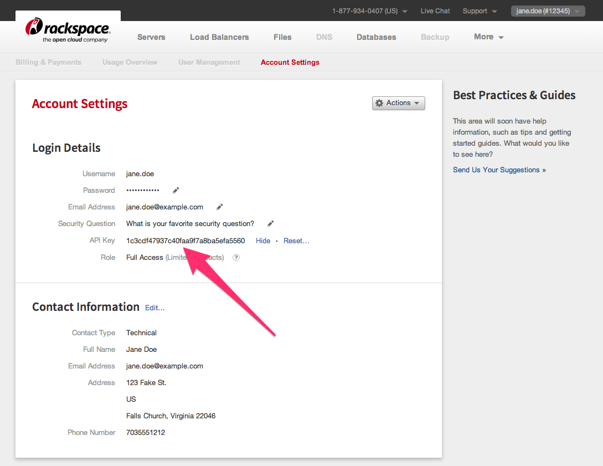

# OpenStack Hackspace

## What you need

This document assumes you have:

- Rackspace credentials
- A computer with
	* Internet access
	* bash or zsh shell 
	* Python
	* Python virtualenv package
	* SSH client

Talk to somebody in the room if you don't have these.

## Getting started

### Get your Rackspace credentials

You should have a Rackspace username and password. You'll be using these to access the cloud. 

1. Log in at <https://mycloud.rackspace.com>
2. Write down the number that appears next to your login name in the top right-hand corner. In the example below, that's 12345.

	

3. Click on your login name on the top-right, then click on "Account Settings"
4. Generate an API key if it's not there yet, and then click "Show"
	
5. Write down your API key.

### Install OpenStack command-line tools

Install the OpenStack command-line tools on your local machine. It's best to install this within a Python virtualenv.

    virtualenv openstack
    source openstack/bin/activate
    pip install rackspace-novaclient python-glanceclient python-cinderclient python-neutronclient python-swiftclient python-keystoneclient
    
    
### Create a valid openrc file for 

Download the linked [rax.openrc] file, and fill in your username, account number, and API key. For example, if your had:
 * username `jane.doe`
 * account number `12345`
 * API key `1c3cdf47937c40faa9f7a8ba5efa5560`
 
 Then edit the following lines

    export OS_USERNAME=jane.doe
    export OS_TENANT_NAME=12345
    export OS_PASSWORD=1c3cdf47937c40faa9f7a8ba5efa5560
    export OS_PROJECT_ID=12345
    
And the entire rax.openrc file should now look like:

	export OS_AUTH_URL=https://identity.api.rackspacecloud.com/v2.0/
	export OS_AUTH_SYSTEM=rackspace
	export OS_REGION_NAME=IAD
	export OS_USERNAME=jane.doe
	export OS_TENANT_NAME=12345
	export OS_PASSWORD=1c3cdf47937c40faa9f7a8ba5efa5560
	export OS_PROJECT_ID=12345
	export OS_NO_CACHE=1
	
	export ST_AUTH=https://auth.api.rackspacecloud.com/v1.0
	export ST_USER=$OS_USERNAME
	export ST_KEY=$OS_PASSWORD

Make sure it's working by trying to list available images on Rackspace:

    source rax.openrc
    nova image-list

The output should look something like this:

	
	+--------------------------------------+----------------------------------------------------------------------------------------------+--------+--------+
	| ID                                   | Name                                                                                         | Status | Server |
	+--------------------------------------+----------------------------------------------------------------------------------------------+--------+--------+
	| a05d3902-4fd8-4c7f-92a9-f985fe299deb | Arch 2013.9                                                                                  | ACTIVE |        |
	| f613b402-ebbf-49fe-a780-101a75c03704 | CentOS 5.9                                                                                   | ACTIVE |        |
	| 25a5f2e8-f522-4fe0-b0e0-dbaa62405c25 | CentOS 6.4                                                                                   | ACTIVE |        |
	| 6bcf33fb-1ed1-44f5-a867-3ee777a590a8 | Debian 6.06 (Squeeze)                                                                        | ACTIVE |        |
	| f45b4de7-6013-4eb9-8df4-133b913ffb40 | Debian 7 (Wheezy)                                                                            | ACTIVE |        |
	| b37fd1ad-6811-4714-941f-17a522b59af4 | Fedora 18 (Spherical Cow)                                                                    | ACTIVE |        |
	| 6fa6747b-764b-4045-b3b2-0c26cb6c4347 | Fedora 19 (Schrodinger's Cat)                                                                | ACTIVE |        |
	| 78a41fcc-de90-428a-a79d-63ecb60cfe58 | FreeBSD 9.1                                                                                  | ACTIVE |        |
	| b09b6acf-598d-48e2-8f24-f06babf5488f | Gentoo 13.3                                                                                  | ACTIVE |        |
	| 1dac45f6-2f61-4011-8c76-1cfb945ad2f0 | OpenSUSE 12.3                                                                                | ACTIVE |        |
	| da3a46dc-ea96-44bb-8f6b-37d65f1d4e23 | Red Hat Enterprise Linux 5.9                                                                 | ACTIVE |        |
	| e0c3a14d-b1dc-451b-ade4-d419501aa121 | Red Hat Enterprise Linux 6.4                                                                 | ACTIVE |        |
	| 6d8cbbf0-2a2d-4db8-8f74-fd1f7a04e7ce | Scientific Linux 6.4                                                                         | ACTIVE |        |
	| 8367d213-8c25-4fa1-927c-e9c34543e51f | Ubuntu 10.04 LTS (Lucid Lynx)                                                                | ACTIVE |        |
	| 25de7af5-1668-46fb-bd08-9974b63a4806 | Ubuntu 12.04 LTS (Precise Pangolin)                                                          | ACTIVE |        |
	| c6f9c411-e708-4952-91e5-62ded5ea4d3e | Ubuntu 12.10 (Quantal Quetzal)                                                               | ACTIVE |        |
	| 592181b4-4153-4198-b65c-0c76b2d335c5 | Ubuntu 13.04 (Raring Ringtail)                                                               | ACTIVE |        |
	| ff228647-fd57-47fe-b42d-2b7813bb9115 | Ubuntu 13.10 (Saucy Salamander)                                                              | ACTIVE |        |
	| 59b394f6-b2e0-4f11-b7d1-7fea4abc60a0 | Vyatta Network OS 6.5R2                                                                      | ACTIVE |        |
	| b349843c-22e6-48c9-8932-d282bd69fc90 | Windows Server 2008 R2 SP1                                                                   | ACTIVE |        |
	| 7462c004-59cb-403c-9a8d-823ce978a00c | Windows Server 2008 R2 SP1 (base install without updates)                                    | ACTIVE |        |
	| b640fa31-d590-4058-b90a-db98d36ec0c8 | Windows Server 2008 R2 SP1 + SQL Server 2008 R2 SP2 Standard                                 | ACTIVE |        |
	| b4a0aee1-a218-455f-8c7a-ecef527d43c4 | Windows Server 2008 R2 SP1 + SQL Server 2008 R2 SP2 Web                                      | ACTIVE |        |
	| fa12f54c-259a-4128-a682-2f8be01520d7 | Windows Server 2008 R2 SP1 + SQL Server 2012 SP1 Standard                                    | ACTIVE |        |
	| 2844cc38-83a0-4e86-b737-eac73c26198b | Windows Server 2008 R2 SP1 + SQL Server 2012 SP1 Web                                         | ACTIVE |        |
	| 0487cb15-9832-4fb7-b2d9-5fc8f55803ad | Windows Server 2008 R2 SP1 + SharePoint 2010 Foundation with SQL Server 2008 R2 Express      | ACTIVE |        |
	| fa14596a-1a70-42d0-bf20-699c35439356 | Windows Server 2008 R2 SP1 + SharePoint 2010 Foundation with SQL Server 2008 R2 SP1 Standard | ACTIVE |        |
	| 332bdd7a-5eed-47da-bbde-d62c8cfdbc23 | Windows Server 2012                                                                          | ACTIVE |        |
	| 68c3112f-bbef-4a17-9b4c-fb7f7444376f | Windows Server 2012 (base install without updates)                                           | ACTIVE |        |
	| 551158b3-96cc-4d34-a41a-3b7e0bd0ffd7 | Windows Server 2012 + SQL Server 2012 SP1 Standard                                           | ACTIVE |        |
	| 2e582334-117e-492d-b48c-2d2d1e90267b | Windows Server 2012 + SQL Server 2012 SP1 Web                                                | ACTIVE |        |
	| 639ec81b-35ac-4346-a275-4f31f7bb9504 | Windows Server 2012 + SharePoint 2013 with SQL Server 2012 SP1 Standard                      | ACTIVE |        |
	+--------------------------------------+----------------------------------------------------------------------------------------------+--------+--------+

[rax.openrc]: https://github.com/lorin/openstack-hackspace/blob/master/rax.openrc