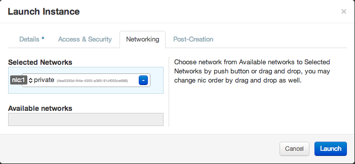
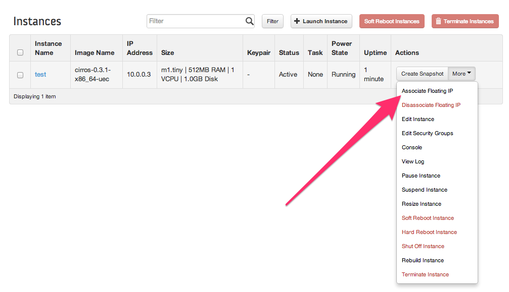
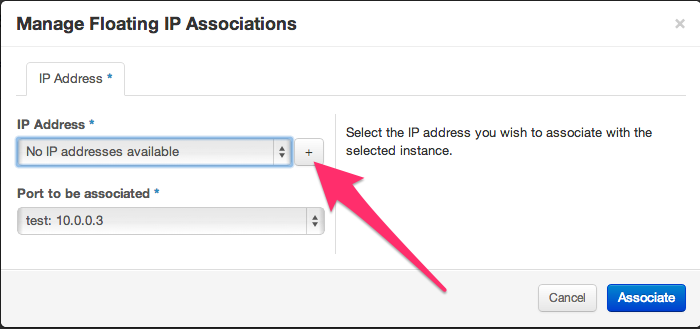

# DevStack

DevStack is an all-in-one OpenStack deployment. In this exercise, we'll
deo a DevStack deployment of the Havana release of OpenStack.

## Launch an instance on Rackspace

We'll use an 8GB standard instance on Ubuntu 12.04:

    $ nova boot --flavor 6 --image c3153cde-2d23-4186-b7da-159adbe2858b --key-name lisa devstack

Output should look like:

    +------------------------+--------------------------------------+
    | Property               | Value                                |
    +------------------------+--------------------------------------+
    | status                 | BUILD                                |
    | updated                | 2013-11-04T04:15:56Z                 |
    | OS-EXT-STS:task_state  | scheduling                           |
    | key_name               | lisa                                 |
    | image                  | Ubuntu 12.04 LTS (Precise Pangolin)  |
    | hostId                 |                                      |
    | OS-EXT-STS:vm_state    | building                             |
    | flavor                 | 8GB Standard Instance                |
    | id                     | 7643b6d2-5782-435a-9056-1e82ac51c853 |
    | user_id                | 97f0118696f24dc18031b5f9a0cfd9df     |
    | name                   | devstack                             |
    | adminPass              | Y9FPzmiVbnF9                         |
    | tenant_id              | 869769                               |
    | created                | 2013-11-04T04:15:56Z                 |
    | OS-DCF:diskConfig      | AUTO                                 |
    | accessIPv4             |                                      |
    | accessIPv6             |                                      |
    | progress               | 0                                    |
    | OS-EXT-STS:power_state | 0                                    |
    | config_drive           |                                      |
    | metadata               | {}                                   |
    +------------------------+--------------------------------------+

You can check the status by doing:

    $ nova show devstack

The "progress" field will tell you the % complete. When the status reaches
`ACTIVE`, the server is ready.

## SSH into the instance

If the IP address is 162.209.96.154, ssh by doing:

    $ ssh -i lisa.key root@162.209.96.154

## Install git

Once inside the instance, update the apt cache and install git:

    # apt-get update
    # apt-get install git

## Grab DevStack

Grab DevStack and switch to the stable/havana branch:

    git clone https://github.com/openstack-dev/devstack.git -b stable/havana

## Create a "stack" user

DevStack can't run as root, so create a "stack" user like this:

    # chmod +x /root/devstack/tools/create-stack-user.sh
    # /root/devstack/tools/create-stack-user.sh

Output should be:

    Creating a group called stack
    Creating a user called stack
    Giving stack user passwordless sudo privileges

## Switch to the stack user

    # sudo -u stack -i

## Check out devstack as stack user

    $ git clone https://github.com/openstack-dev/devstack.git -b stable/havana

## Create /opt/stack/devstack/local.conf

Create `/opt/stack/devstack/local.conf` with the following contents.

Note: You must change `HOST_IP` to match your actual public IP.

    [[local|localrc]]
    # CHANGE ME TO MATCH PUBLIC IP
    HOST_IP=162.209.96.154

    SCREEN_LOGDIR=/opt/stack/logs

    # Enable Neutron
    disable_service n-net
    enable_service q-svc
    enable_service q-agt
    enable_service q-dhcp
    enable_service q-l3
    enable_service q-meta
    enable_service neutron

    # Enable Swift
    enable_service s-proxy
    enable_service s-object
    enable_service s-container
    enable_service s-account

    # Disable security groups entirely
    Q_USE_SECGROUP=False
    LIBVIRT_FIREWALL_DRIVER=nova.virt.firewall.NoopFirewallDriver

    # Disable tempest
    disable_service tempest

## Run stack.sh as stack user

    $ cd ~/devstack
    $ ./stack.sh

Hit enter each time it asks you a question.

It will then proceed to install OpenStack on the single node. This will take
about twelve minutes. The output should look like this:

    Horizon is now available at http://162.209.96.154/
    Keystone is serving at http://162.209.96.154:5000/v2.0/
    Examples on using novaclient command line is in exercise.sh
    The default users are: admin and demo
    The password: 08a85950ecd4cff5e631
    This is your host ip: 162.209.96.154
    stack.sh completed in 743 seconds.

The password is also set as `ADMIN_PASSWORD` in the localrc file

You should now be able to access the dashboard by pointing your web browser
at the public IP of your instance.

 * Username: demo
 * Password: (see `ADMIN_PASSWORD` variable in `/opt/stack/devstack/localrc`)

## Launch an instance inside of DevStack

1. Click "CURRENT PROJECT" at the left and select "demo"

1. Click the "Instances" link on the left, and click "Launch instance".

    * Availability Zone: nova
    * Instance Name: test
    * Flavor: m1.tiny
    * Instance Count: 1
    * Instance Boot Source: Boot from image.
    * Image Name: cirros-0.3.1-x86_64-uec (24.0 MB)

    

1. Click "Networking"

1. Drag "private" from "Available networks" to "Selected Networks"

    

1. Click "Launch"

## Allocate a floating IP and attach to an instance

By default, OpenStack instances aren't reachable without a floating IP.

1. At the "Instances" view, click "More" under Actions and choose "Associate
floating IP".

    

1. Click the "+" next to "No IP addresses available" to alllocate a new
floating IP.

    

1. Click "Allocate IP" to allocate an IP address from the "public" pool.

1. Click "Associate" to associate the IP address with the instance.

If you reload the Instances view, you should now see two IP addresses,
which are most likely:

 * 10.0.0.3
 * 172.24.4.227

Try to ssh to the 172.24.4.227 address, which is the floating IP.

* Username: `cirros`
* Password: `cubswin:)`

    $ ssh cirros@172.24.4.227
    The authenticity of host '172.24.4.227 (172.24.4.227)' can't be established.
    RSA key fingerprint is b4:6f:8b:86:e8:8b:73:56:ac:3d:c2:ab:57:7e:eb:7f.
    Are you sure you want to continue connecting (yes/no)? yes
    Warning: Permanently added '172.24.4.227' (RSA) to the list of known hosts.
    cirros@172.24.4.227's password:
    $

