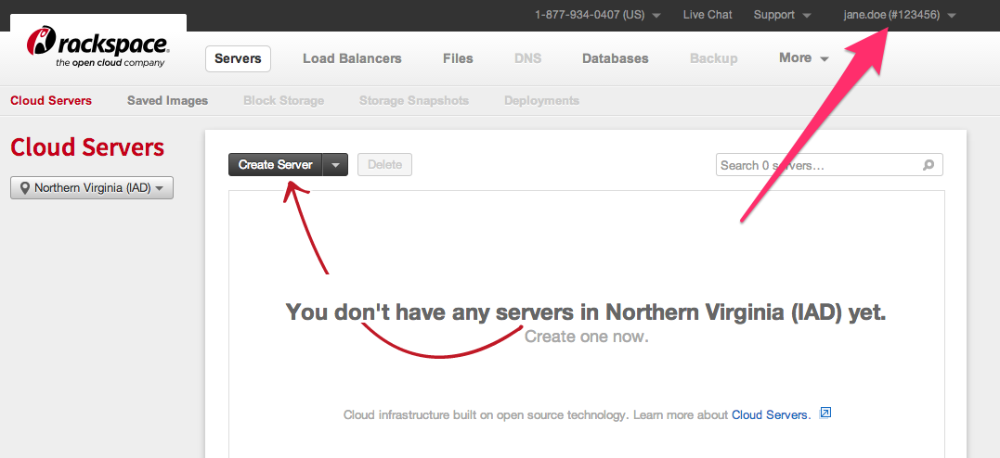

# Getting started

## Get your Rackspace credentials

You should have a Rackspace username and password. You'll be using these to access the cloud.

1. Log in at <https://mycloud.rackspace.com>
2. Write down the number that appears next to your login name in the top right-hand corner. In the example below, that's 12345.

    

3. Click on your login name on the top-right, then click on "Account Settings"
4. Generate an API key if it's not there yet, and then click "Show"
    
5. Write down your API key.

### Install OpenStack command-line tools

Install the OpenStack command-line tools on your local machine. It's best to install this within a Python virtualenv.

    $ virtualenv openstack
    $ source openstack/bin/activate
    $ pip install rackspace-novaclient python-glanceclient python-cinderclient python-neutronclient python-swiftclient python-keystoneclient

### Create a valid openrc file for

Download the linked [rax.openrc] file, and fill in your username, account number, and API key. For example, if your had:

 * username `jane.doe`
 * account number `12345`
 * API key `1c3cdf47937c40faa9f7a8ba5efa5560`

 Then edit the following lines

    export OS_USERNAME=jane.doe
    export OS_TENANT_NAME=12345
    export OS_PASSWORD=1c3cdf47937c40faa9f7a8ba5efa5560
    export OS_PROJECT_ID=12345

And the entire rax.openrc file should now look like:

    export OS_AUTH_URL=https://identity.api.rackspacecloud.com/v2.0/
    export OS_AUTH_SYSTEM=rackspace
    export OS_REGION_NAME=IAD
    export OS_USERNAME=jane.doe
    export OS_TENANT_NAME=12345
    export OS_PASSWORD=1c3cdf47937c40faa9f7a8ba5efa5560
    export OS_PROJECT_ID=12345
    export OS_NO_CACHE=1

    export ST_AUTH=https://auth.api.rackspacecloud.com/v1.0
    export ST_USER=$OS_USERNAME
    export ST_KEY=$OS_PASSWORD

### Confirm compute client is working

Make sure the OpenStack Compute client (nova) is working by trying to list available images on Rackspace:

    $ source rax.openrc
    $ nova flavor-list

The output should look something like this:

	+----+-------------------------+-----------+------+-----------+------+-------+-------------+-----------+
	| ID | Name                    | Memory_MB | Disk | Ephemeral | Swap | VCPUs | RXTX_Factor | Is_Public |
	+----+-------------------------+-----------+------+-----------+------+-------+-------------+-----------+
	| 2  | 512MB Standard Instance | 512       | 20   | 0         | 512  | 1     | 80.0        | N/A       |
	| 3  | 1GB Standard Instance   | 1024      | 40   | 0         | 1024 | 1     | 120.0       | N/A       |
	| 4  | 2GB Standard Instance   | 2048      | 80   | 0         | 2048 | 2     | 240.0       | N/A       |
	| 5  | 4GB Standard Instance   | 4096      | 160  | 0         | 2048 | 2     | 400.0       | N/A       |
	| 6  | 8GB Standard Instance   | 8192      | 320  | 0         | 2048 | 4     | 600.0       | N/A       |
	| 7  | 15GB Standard Instance  | 15360     | 620  | 0         | 2048 | 6     | 800.0       | N/A       |
	| 8  | 30GB Standard Instance  | 30720     | 1200 | 0         | 2048 | 8     | 1200.0      | N/A       |
	+----+-------------------------+-----------+------+-----------+------+-------+-------------+-----------+

### Confirm object storage client is working

Make srue the OpenStack Object Storage client (swift) is working by checking the status of your object storage account:

    $ source rax.openrc
    $ swift stat
    
The output should look something like this:

	   Account: MossoCloudFS_4911155b-32a5-317a-d0ef-6db8f4887013
	Containers: 0
	   Objects: 0
	     Bytes: 0
	Content-Type: text/plain; charset=utf-8
	X-Timestamp: 1383359439.45298
	X-Trans-Id: txf8f114e6ecac49db9c5e0-00527463cfiad3
	X-Put-Timestamp: 1383359439.45298

[rax.openrc]: https://github.com/lorin/openstack-hackspace/blob/master/rax.openrc